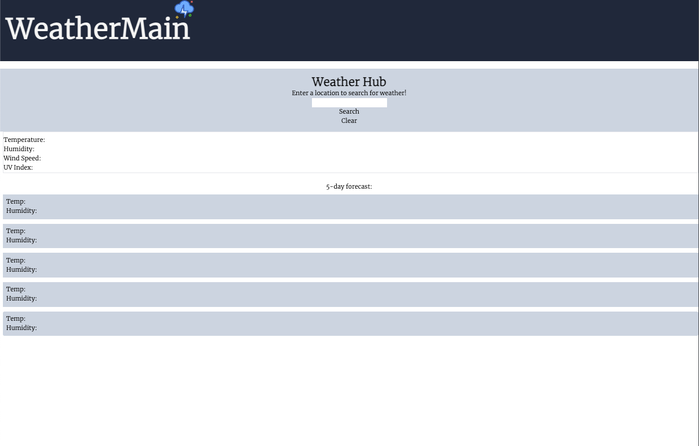

# weather-dashboard
## Welcome


## Description


## Table of Contents


## Due Date
```
- Project presentations will be on Thursday, April 14, 2022 @ 7:00 PM

- The project itself is due on Sunday, April 17, 2022 @ 11:59 PM
```
```
Each member of your group is required to submit the following for review:

- The URL of the deployed application.

- The URL of the GitHub repository, with a unique name and a README describing the project.

- The URL of your portfolio, with your project added to it.
```

## Objectives
```
AS A family provider
I WANT to find out the current exchange rates between two currencies
SO THAT I can send money to family overseas
```

### **Additional Criteria**

**Technical Acceptance: 40%**

- [x] Uses the OpenWeather API to retrieve weather data
- [ ] Uses localStorage to store persistent data 


**Deployment: 32%**

- [x] Application deployed at live URL
- [x] Application loads with no errors
- [x] Application GitHub URL submitted
- [x] GitHub repository that contains application code

**Application Quality: 15%**

- [x] Application user experience is intuitive and easy to navigate
- [x] Application user interface style is clean and polished
- [x] Application is responsive

**Repository Quality: 13%**

- [x] Repository has a unique name
- [x] Repository follows best practices for file structure and naming conventions
- [x] Repository follows best practices for class/id naming conventions, indentation, quality comments, etc.
- [x] Repository contains multiple descriptive commit messages
- [x] Repository contains quality README.md with description, screenshots, link to deployed application


### **MOCK UP**



## Technologies

Languages
- HTML
- CSS
- JavaScript
- Markdown

Frameworks
- Tailwind CSS
- jQuery

APIs
- openweatherAPI

Repository
- GitHub

## Installation

```
(Work in progress...)
```

## Usage

```
(Work in progress...)
```

## Collaborators

- [Michael Tulmen](https://github.com/Michael-Tulmen)


## License
MIT License

Copyright (c) 2022 Michael-Tulmen

Permission is hereby granted, free of charge, to any person obtaining a copy
of this software and associated documentation files (the "Software"), to deal
in the Software without restriction, including without limitation the rights
to use, copy, modify, merge, publish, distribute, sublicense, and/or sell
copies of the Software, and to permit persons to whom the Software is
furnished to do so, subject to the following conditions:

The above copyright notice and this permission notice shall be included in all
copies or substantial portions of the Software.

THE SOFTWARE IS PROVIDED "AS IS", WITHOUT WARRANTY OF ANY KIND, EXPRESS OR
IMPLIED, INCLUDING BUT NOT LIMITED TO THE WARRANTIES OF MERCHANTABILITY,
FITNESS FOR A PARTICULAR PURPOSE AND NONINFRINGEMENT. IN NO EVENT SHALL THE
AUTHORS OR COPYRIGHT HOLDERS BE LIABLE FOR ANY CLAIM, DAMAGES OR OTHER
LIABILITY, WHETHER IN AN ACTION OF CONTRACT, TORT OR OTHERWISE, ARISING FROM,
OUT OF OR IN CONNECTION WITH THE SOFTWARE OR THE USE OR OTHER DEALINGS IN THE
SOFTWARE.